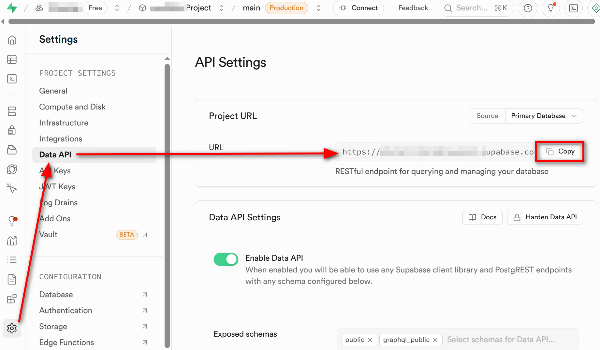
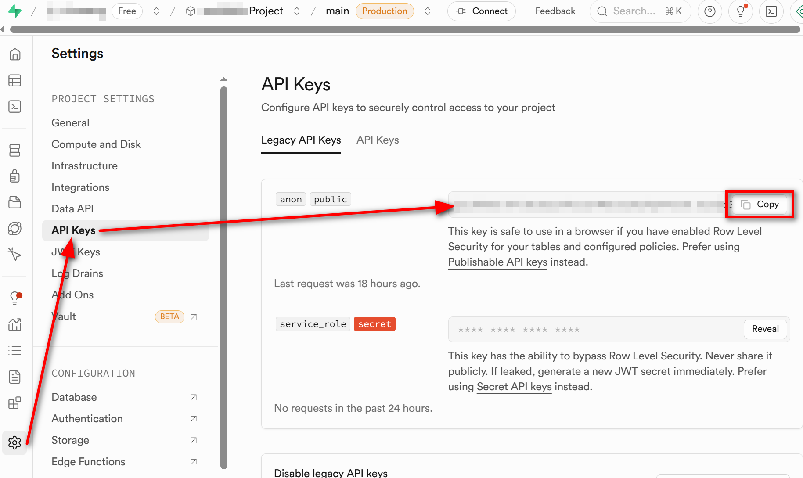

# Keep Your Free-Tier Supabase Project Active

A Python script that inserts one row to a table to prevent your Supabase project from being inactivated due to inactivity for more than 7 days.

## Setup Instructions

### 1. Install Dependencies
```bash
pip install supabase
```

### 2. Create Database Table
Go to your Supabase dashboard > SQL Editor and run:
```sql
CREATE TABLE IF NOT EXISTS activity_log (
    id SERIAL PRIMARY KEY,
    timestamp TIMESTAMP WITH TIME ZONE DEFAULT NOW(),
    message TEXT DEFAULT 'Keep-alive ping'
);
```

### 3. Configure Credentials

#### Finding Your Project URL and API Keys:
1. Go to your Supabase project dashboard
2. Click on "Settings" in the left sidebar
3. Click on "API" in the settings menu

**Project URL:**
- Look for "Project URL" in the API settings
- It will look like: `https://your-project-id.supabase.co`
- 

**Anon/Public Key:**
- Look for "anon public" or "public" key in the API settings
- It starts with `eyJhbGciOiJIUzI1NiIsInR5cCI6IkpXVCJ9...`
- 

Replace the placeholder values in `main.py`:
- `os.environ['SUPABASE_URL']` with your Project URL
- `os.environ['SUPABASE_KEY']` with your anon public key

### 4. Schedule Automatic Runs (Linux)
Assuming you are on Linux, run `crontab -e` and add this line:
```
0 12 * * * /path/to/python3 /path/to/main.py
```

This will run the script every day at noon (12:00 PM).


